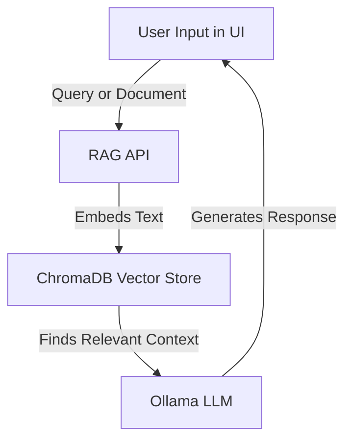

# DMZ LLM + RAG Sandbox

A self-contained, Docker-based environment simulating a **DMZ Large Language Model** with Retrieval-Augmented Generation (RAG) capabilities.  
Includes a lightweight dev machine, web-based desktop (Webtop), and a Streamlit UI for interaction.

---

## 📦 Components

### **Backend**
- **Ollama** — Runs the selected LLM model (default: `llama3`).
- **RAG API** — FastAPI + ChromaDB backend for document ingestion and semantic search.
- **Vector Store** — ChromaDB (embedded inside RAG API container) stores embeddings and metadata.

### **Frontend**
- **Streamlit UI** — Web interface to:
  - Send prompts directly to the LLM.
  - Ingest text into the RAG knowledge base.
  - Query the RAG for context-aware answers.

### **Dev Environment**
- **Dev Machine** — SSH-accessible Ubuntu container for testing tools in the same network.
- **Webtop** — Browser-accessible Ubuntu desktop with a web browser, running fully in Docker.

---

## 🗂 Project Structure
```bash
project-root/
├── docker-compose.yml # Orchestrates all services
├── llm/ # Ollama build & init scripts
├── rag-api/ # RAG backend
├── frontend/ # Streamlit frontend
├── dev-machine/ # CLI dev environment
└── webtop-config/ # Webtop persistent storage
```
---

## 📦 Services
- **ollama** – LLM service for natural language processing.
- **rag-api** – Backend for document ingestion & retrieval.
- **llm-ui** – Streamlit web app for querying the LLM.
- **dev-machine** – SSH-accessible terminal environment.
- **webtop** – Lightweight remote Linux desktop with browser.

---
## 📊 How RAG Works


---

## 🚀 Getting Started

### 1. Clone the repository
```bash
git clone https://github.com/war1u5/cydex_scenario
cd project-root
```
### 2. Build and start all services:
```bash
docker compose up --build -d
```
### 3. Access the services:
- **Frontend UI**: http://localhost:8501
- **Webtop (GUI)**: http://localhost:3000
- **SSH Dev Machine**: `ssh -p 2222 user@localhost`

## 📌 Usage
- Use **/ingest** endpoint in RAG API to store documents.
- Use **/query** endpoint to retrieve context-aware answers.
- Directly interact with the LLM via the Streamlit UI.
- Develop inside `dev-machine` or use `webtop` for GUI tools.

## ⚠️ Notes
- Ensure Docker and Docker Compose are installed.
- Update `.env` or environment variables for custom configuration.
- The system is meant for local/offline usage; secure before exposing.